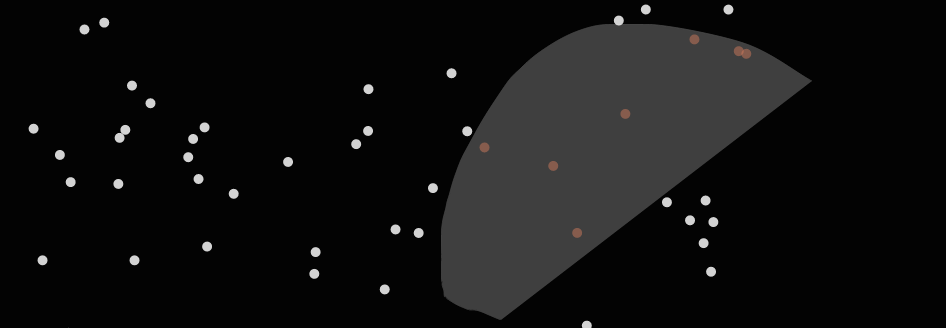

# d3-simple-lasso

<p align="center">
  
</p>

a small and simple implementation for a lasso selection in d3.

install with:

```
bower install -S https://github.com/HendrikStrobelt/d3-simple-lasso.git
```

initiate it with:

```
d3lasso(backgroundSelection, overlaySelection, elementsSelection, xAccessor, yAccessor)
```

the elements are:

- <b>backgroundSelection </b> is a d3 selection of a background `<g>` element (see [example.html](example.html)) where mouse clicks are detected
- <b>overlaySelection</b> is a d3 selection of a overlay `<g>` element (see [example.html](example.html)) where the selection polygon is drawn
- <b>elementsSelection</b> is a d3 selection that contains the elements to be highlighted
- <b>xAccessor and yAccessor</b> are functions on how to retrieve x and y coordinates from the <b>data object</b> that represent each item. Default is `function(d){return d.y}` 
